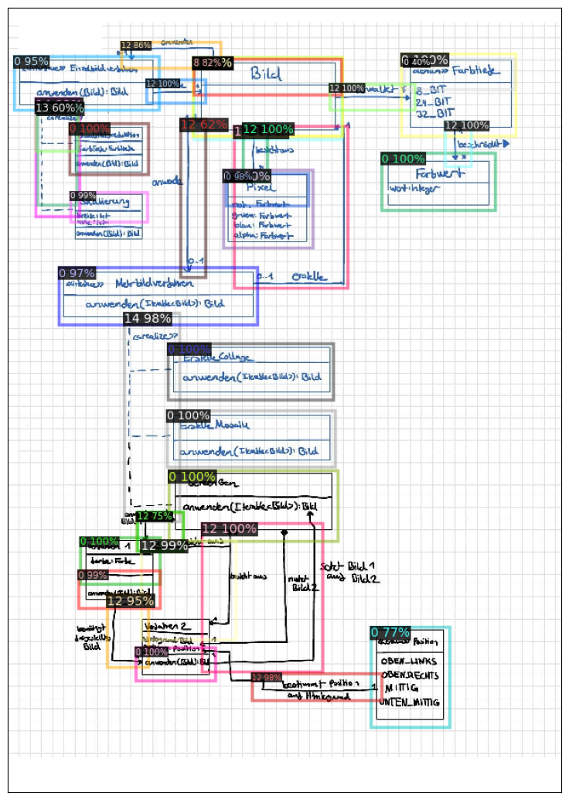

# Sketch Detection

This repository contains the code and materials for the practical course "Werkzeuge für Agile Modellierung"
conducted at the Karlsruher Institute for Technology (KIT). The primary objective of this practical course was to
research, explore, and develop a neuronal network with [detectron2](https://github.com/facebookresearch/detectron2)
for recognizing hand drawn sketches.

Here is an example of a diagram that can be recognized by the model:


## Background

This work is based on the
paper ["Arrow R-CNN for handwritten diagram recognition" by Bernhard Schäfer](https://link.springer.com/article/10.1007/s10032-020-00361-1).
The paper introduces "Arrow R-CNN," a deep learning system designed for recognizing both the symbols and structure in
offline handwritten diagrams. While existing deep learning object detectors can identify diagram symbols, they struggle
with understanding the diagram's overall structure. Arrow R-CNN builds upon the Faster R-CNN object detector by
incorporating an arrow head and tail keypoint predictor.

The paper suggests that this arrow head and tail keypoint predictor can play a pivotal role in deducing the diagram's
structure. To achieve this, the authors introduce a customized loss function that penalizes the model for making
inaccurate predictions regarding the placement of arrow heads and tails. The authors incorporate a new "Arrow Keypoint
Regression" layer into the Region of Interest (ROI) head of the Faster R-CNN model. This layer is then used to calculate
a keypoint regression loss that is combined with the existing Faster R-CNN loss functions.

## Training data

The network is trained on the
dataset [bernhardschaefer/handwritten-diagram-datasets](https://github.com/bernhardschaefer/handwritten-diagram-datasets).
This dataset is provided by the authors of the paper. It contains 308 diagrams with over 10366 annotated symbols. The
test data contain 92 diagrams with 3310 annotations.

Here is a diagram of the label distribution in the training data:


### Structure

The repository is organized as follows:

```
.
├── data                                            # Data folder
├── models                                          # Model folder
├── notebooks                                       # Jupyter notebooks
│   ├── predictions.ipynb                           # Notebook for recognizing a single image
│   ├── analyse_dataset.ipynb                       # Notebook for analysing training data
│   ├── model_trainer.ipynb                         # Notebook for training models
│   ├── evaluation.ipynb                            # Notebook for evaluating models
│   └── simple_compare.ipynb                        # Notebook for comparing models directly
├── references                                      # Reference material
├── reports                                         # Evaluation reports
├── requirements.txt                                # Python requirements
└── src                                             # Source code
    ├── dataset                                     # Code for loading the dataset
    ├── sketch_detection_rcnn                       # Custom detectron2 model
    ├── utils                                       # Utility functions
    └── visualization                               # Visualization functions
```

## Implementing Network Architecture

This repository is based on the [detectron2](https://github.com/facebookresearch/detectron2) framework. Detectron2 is
Meta AI Research's next-generation software system that implements state-of-the-art object detection algorithms. It is
written in Python and powered by the PyTorch deep learning framework. Detectron2 is a complete rewrite of the first
version of Detectron, which was based on the Caffe2 deep learning framework. Detectron2 includes high-quality
algorithms and models, as well as a wide range of features, including a flexible model architecture that allows for
easy configuration and experimentation.

### Arrow R-CNN

The Arrow R-CNN model, proposed by Bernhard Schäfer, is implemented in the `src/sketch_detection_rcnn` folder. The model
is based on the Faster R-CNN model and is modified to include a keypoint regression layer in the ROI head.

Two files are relevant for the implementation of the model:

* [SketchRCNNOutputLayers](src/sketch_detection_rcnn/output_layers): This class add the keypoint predictions to the
  output layers. It also ensures that the keypoint regression loss is added to the training process. The unmodified
  output layers class is
  [GeneralizedRCNN](https://github.com/facebookresearch/detectron2/blob/main/detectron2/modeling/meta_arch/rcnn.py).
* [SketchROIHeads](src/sketch_detection_rcnn/sketch_rcnn.py[roi_heads.py](src%2Fsketch_detection_rcnn%2Froi_heads.py)):
  This class adds the keypoint regression layer to the ROI heads. It also implements the keypoint regression loss
  function. The unmodified ROI heads class
  is [StandardROIHeads](https://github.com/facebookresearch/detectron2/blob/main/detectron2/modeling/roi_heads/roi_heads.py)

## Using a trained model

### Command Line Interface

The command line interface is implemented in `src/cmd/sketch_recognizer.py`. It can be run with the following command:

```bash
python -m src.cmd.sketch_recognizer --model models/amazing_ramanujan --image data/test.jpg
```

### REST-API

The REST API is implemented with [Flask](https://flask.palletsprojects.com/).

```bash
# Start the API
python -m src.cmd.server --model models/amazing_ramanujan

# Send a request
curl -X 'POST' \
  'http://127.0.0.1:8000/' \
  -H 'accept: application/json' \
  -H 'Content-Type: multipart/form-data' \
  -F 'file=@data/test.jpg;type=image/jpeg'
```

### Docker

The model can also be run in a Docker container.

```bash
# Build the image
docker build -t sketch_recognizer .

# Run the container
docker run --rm -p 8000:8000 -v ./models/:/models -it sketch_recognizer --model /models/amazing_ramanujan
```

> When using Podman, if you encounter the `sd-bus call: Input/output error` issue, include `--cgroup-manager=cgroupfs`
> in the command.

## Evaluation

The evaluation of the models is conducted with the [evaluation notebook](notebooks%2Fevaluation.ipynb).

| model             | iterations | batch_size | training_time | bbox_AP            | ROI_HEADS_NAME   | validation_count | box_precision      | box_recall         | box_f1             | class_sensitivity  |
|-------------------|------------|------------|---------------|--------------------|------------------|------------------|--------------------|--------------------|--------------------|--------------------|
| clever_villani    | 3000       | 10         | ~2h           | 58.50243354708324  | SketchROIHeads   | 102              | 0.7377094972067039 | 0.7731264637002342 | 0.7550028587764436 | 0.96932979931844   |
| practical_wilson  | 3000       | 10         | ~2h           | 54.32569187314482  | StandardROIHeads | 102              | 0.7239349775784754 | 0.7561475409836066 | 0.7396907216494845 | 0.962059620596206  |
| amazing_ramanujan | 30000      | 10         | ~22h          | 60.110533049085134 | SketchROIHeads   | 102              | 0.7744988864142539 | 0.8144028103044496 | 0.7939497716894977 | 0.9744787922358016 |

The evaluation results can be found in the [sketch_evaluation.csv](reports%2Fsketch_evaluation.csv) in more detail.

